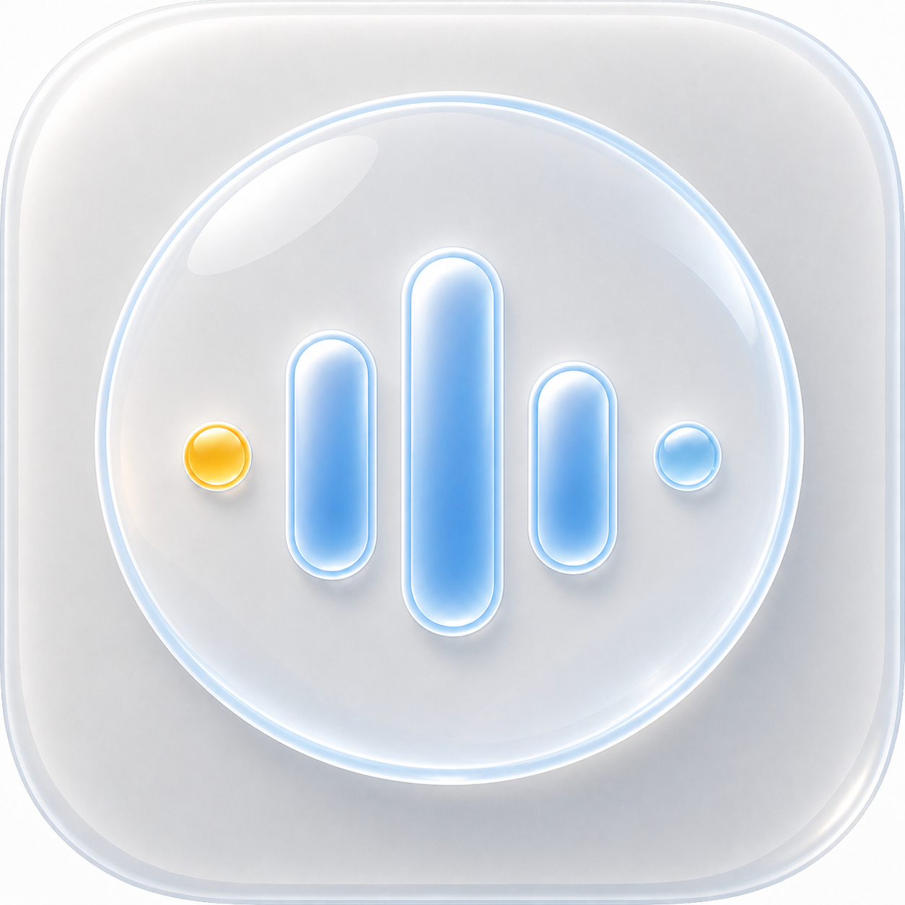
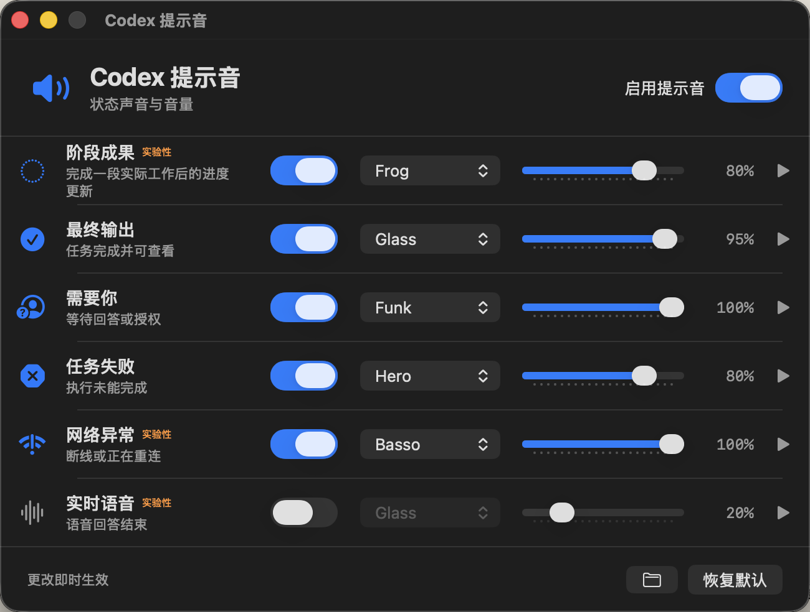

# Codex Notification Settings

[中文](README.md) · [English](README.en.md)


一个面向 macOS 的非官方 Codex 提示音设置工具：让你知道任务完成了、正在等待你，还是执行失败，而不必一直盯着 Codex 窗口。

<div align="center">
  <table>
    <tr>
      <td align="center" valign="middle" width="190">
        
      </td>
      <td align="center" valign="middle">
        
      </td>
    </tr>
  </table>
  <p><sub>原生 SwiftUI 设置界面 · Native SwiftUI settings UI</sub></p>
</div>

<p align="center">
  <a href="https://github.com/cyberxz2077/codex-notification-settings/releases/tag/v1.0.2"><strong>下载 v1.0.2</strong></a> ·
  <a href="INSTALL.md">安装说明</a> ·
  <a href="https://github.com/cyberxz2077/codex-notification-settings/issues">反馈问题</a>
</p>

## 为什么做这个

Codex 的默认提示往往只能告诉你“有事情发生了”，却不能让你立刻分辨是完成、等待你，还是失败。这个小工具针对的就是“状态没有区分”的问题：为每种状态绑定不同声音和音量，让同一套 Codex 工作流听起来有清晰的层次。

> 核心区别：让“阶段成果 / 最终输出 / 需要你 / 任务失败”不再听起来一样。

## 功能

| 状态 | 默认声音 | 说明 |
| --- | --- | --- |
| 阶段成果 | Pop 25% | 完成一段实际工具工作后的进度更新，实验性 |
| 最终输出 | Hero 50% | 当前任务回合已经结束 |
| 需要你 | Ping 45% | 任务在等待回答或授权 |
| 任务失败 | Basso 40% | 执行未能完成 |
| 网络异常 | Submarine 30% | 连接异常或重连，实验性 |
| 实时语音 | 默认关闭 | 避免语音回答结束后再响一次系统提示音，实验性 |

- 每种状态可独立开关、选声音和调音量。
- 切换声音后自动试听，播放按钮可重复试听。
- 保留并转发安装前已有的 Codex `notify` 命令。
- 阶段监听器独立运行，设置 App 不需要常驻 Dock。
- 同一任务回合会限频去重，避免重复响铃。
- 跟随 macOS 首选语言；中文系统显示中文，其他语言默认显示英文。

状态与客户端边界见 [兼容性说明](docs/COMPATIBILITY.md)。

## 系统要求

- macOS 13 或更高版本。
- 已安装并使用 Codex 桌面客户端或 Codex CLI。
- 下载发布包运行不需要 Python、Homebrew 或 Xcode。
- 只有从源码构建时才需要 Xcode Command Line Tools 与 Swift 6。
- `terminal-notifier` 是可选项；缺少它时声音仍可播放，只是不额外显示本工具的通知横幅。

## 安装

### 发布包（推荐）

从 [GitHub Releases](https://github.com/cyberxz2077/codex-notification-settings/releases) 下载推荐版本 [v1.0.2](https://github.com/cyberxz2077/codex-notification-settings/releases/tag/v1.0.2) 的 `Codex-Notification-Settings-1.0.2-macos.zip`，解压后双击 `Install.command`。详细步骤见 [INSTALL.md](INSTALL.md)。

### 从源码安装

```bash
git clone https://github.com/cyberxz2077/codex-notification-settings.git
cd codex-notification-settings
make test
./Scripts/install.sh
```

安装器会：

1. 把设置 App 安装到 `~/Applications/`。
2. 把通知引擎安装到 `~/Library/Application Support/Codex Notification Settings/`。
3. 安装由同一 Swift 可执行文件提供的原生后台引擎，不依赖 Python。
4. 增量修改 `~/.codex/config.toml` 的 `notify`，并保存原命令供转发和卸载恢复。
5. 安装实验性的阶段成果监听器。

安装后重新打开 Codex。声音配置保存在 `~/.codex/notification-settings.json`，修改即时生效。

不希望启用实验性阶段监听器时：

```bash
CODEX_NOTIFY_EXPERIMENTAL_STAGE=0 ./Scripts/install.sh
```

## 卸载

```bash
./Scripts/uninstall.sh
```

卸载器只在当前 `notify` 仍属于本工具时恢复安装前配置，不会覆盖后来由其他工具接管的配置。应用和运行文件会移动到废纸篓中的独立目录，声音设置文件默认保留。

## 构建与打包

```bash
make build
make test
./Scripts/package-release.sh 1.0.2
```

产物位于 `dist/`。构建脚本会生成同时支持 Apple Silicon 与 Intel Mac 的 Universal 2 App，并使用直接 `swiftc` 编译，以避开部分 Swift 6 工具链在 SwiftUI release 优化阶段的编译器崩溃。Swift Package 仍用于 IDE 索引和调试构建。

本地构建采用 ad-hoc 签名，只适合开发与自用。面向普通用户发布前，需要使用 Apple Developer ID 签名并完成 notarization，否则 Gatekeeper 可能阻止直接打开。

## 工作原理

- App 内的原生 Swift 引擎接收 Codex `notify` 回调，同时转发给安装前已有的通知命令。
- 同一引擎负责事件分类、并发安全去重，并调用 macOS `afplay`。
- 实验性阶段监听模式只读观察 `~/.codex/sessions/` 新增的 rollout JSONL 记录，识别完成工具工作后的阶段更新。
- SwiftUI 设置 App 与后台引擎共享同一份 JSON 配置，没有常驻播放进程。

## 隐私与限制

- 所有处理均在本机完成，不上传提示音配置或 Codex 会话内容。
- 阶段成果与实时语音识别依赖 Codex 的内部本地记录格式，Codex 更新后可能需要适配。
- 网络、失败和等待输入并非所有客户端版本都会提供结构化事件，因此可能漏报；文本分类不会把普通回答中提到的 “reconnecting” 误判为网络故障。
- 本项目不会读取 API key、密码或环境变量文件。

更完整的说明见 [隐私说明](PRIVACY.md) 和 [安全政策](SECURITY.md)。

## 反馈与参与

如果这个工具帮你少盯了一会儿 Codex，欢迎在 GitHub 点一个 Star，或分享你的声音配置；Star 会让其他遇到同样问题的人更容易找到它。

遇到问题时，请优先附上 macOS 版本、Codex 版本、是否使用桌面客户端或 CLI，以及脱敏后的 `Doctor.command` 输出。不要上传会话记录、API key、密码或完整个人路径。

- [报告 Bug](https://github.com/cyberxz2077/codex-notification-settings/issues/new?template=bug_report.yml)
- [提出功能建议](https://github.com/cyberxz2077/codex-notification-settings/issues/new?template=feature_request.yml)
- [参与贡献](CONTRIBUTING.md)
- [中英文分享文案](docs/COMMUNITY-POSTS.md)

## 常见问题

### 这是 OpenAI 官方应用吗？

不是。这是社区维护的开源 macOS 工具，与 OpenAI 没有隶属或背书关系。

### 为什么有些状态标记为“实验性”？

阶段成果和实时语音依赖 Codex 的本地 rollout JSONL 格式；网络、失败和等待输入也取决于客户端是否发出结构化事件。它们可能随 Codex 更新而需要适配。

### 下载后应该打开哪个文件？

普通用户只需要解压并双击 `Install.command`，安装完成后打开 `Codex Notification Settings.app`。不要直接运行安装目录或支持目录里的 `CodexNotificationEngine`，它是后台组件。

## 发展方向

以下方向仍是探索项，不代表已承诺的时间表：更简单的升级入口、更多 Codex 客户端兼容性测试，以及通过真实用户反馈调整默认声音和状态说明。

## 免责声明

这是社区维护的非官方项目，与 OpenAI 无隶属或背书关系。Codex 是 OpenAI 的产品名称。请从 [OpenAI Codex 官方文档](https://developers.openai.com/codex/) 获取官方配置与产品信息。

## License

[MIT](LICENSE)
